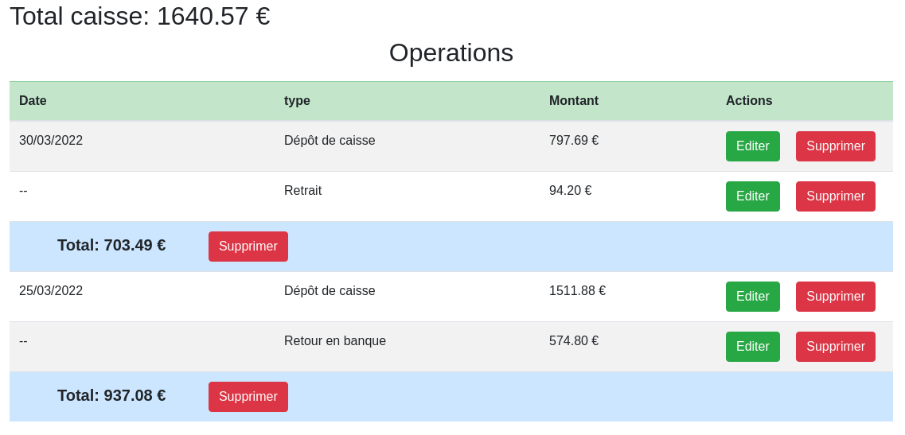

# Cash Register

Vous pouvez accéder à l'application de test à l'adresse suivante:
https://codalia.net/cash_register/

login: admin@cashregister.com  
passwd: mysecret

# Notes et remarques.

Il y a une légère incohérence dans l'énoncé concernant la page de type dashboard.
En effet, l'énoncé et le screenshot sont en contradiction:

Dans le screenshot les colonnes "Ajouts" et "Retraits" sont inutiles puisque la colonne "Type" (non mentionné dans l'énoncé) indique déjà la nature de l'opération (dépôt, retrait...).  
Quant à la colonne "Montant" (non mentionné dans l'énoncé), elle est ambigue car elle fait double emploi avec la colonne "Total".  
De plus, étant donné que les actions (edition/suppression) sont assignées à plusieurs opérations à chaque fois, comment faire si je veux agir uniquement sur une opération de type retrait par ex ?

Je pense que le problème ici vient du fait que plusieurs niveaux de données (les opérations du jour) sont ramenées à un seul niveau (ie: une ligne de tableau) ce qui occasionne de la répétition d'information ainsi qu'un manque de clarté.

Aussi afin de contourner ces problèmes, je propose d'ajouter une ligne de total qui s'affiche après les lignes d'opérations regroupées par date. 
De cette façon la lecture est beaucoup plus claire et on peut agir sur chaque opération du jour individuellement.  



N.B: Ne sachant pas exactement comment la caisse est gérée j'ai laissé la possibilité de supprimer les opérations jounalières individuellement.


# CRepeater   
Le repeater utilisé pour les ajouts et suppressions des items de monnaie est une mini librairie que j'ai moi-même développé en Vanilla JS. 
Cette librairie est disponible ici: https://github.com/Duddy67/crepeater  

# Installation

Le répertoire ne contient que les fichiers nécessaires au projet de test, il ne contient pas tout le framework Laravel.  
*L'application est compatible avec Laravel 8/9*  
Pour installer l'application sur un serveur:  
```
composer create-project laravel/laravel myproject

cd myproject 

composer require laravel/ui --dev

php artisan ui:auth

rm README.md
rm routes/web.php

git init .
git remote add origin git@github.com:Duddy67/cash-register.git

git pull origin main

php artisan migrate
```
*(passwd: secret)*


